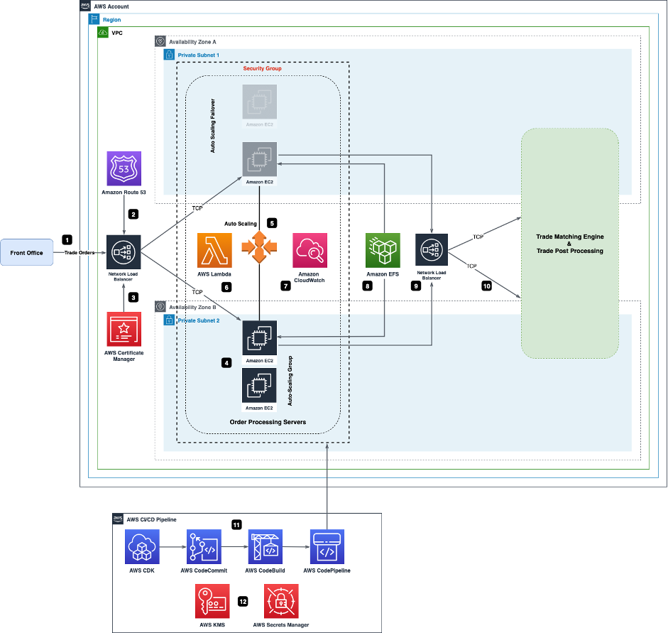
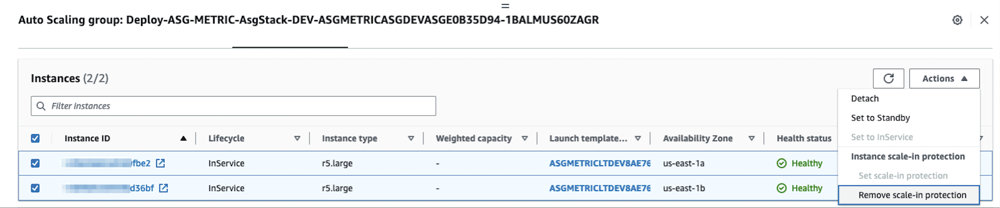

Copyright Amazon.com, Inc. or its affiliates. All Rights Reserved.
SPDX-License-Identifier: MIT-0

Permission is hereby granted, free of charge, to any person obtaining a copy of this
software and associated documentation files (the "Software"), to deal in the Software
without restriction, including without limitation the rights to use, copy, modify,
merge, publish, distribute, sublicense, and/or sell copies of the Software, and to
permit persons to whom the Software is furnished to do so.

THE SOFTWARE IS PROVIDED "AS IS", WITHOUT WARRANTY OF ANY KIND, EXPRESS OR IMPLIED,
INCLUDING BUT NOT LIMITED TO THE WARRANTIES OF MERCHANTABILITY, FITNESS FOR A
PARTICULAR PURPOSE AND NONINFRINGEMENT. IN NO EVENT SHALL THE AUTHORS OR COPYRIGHT
HOLDERS BE LIABLE FOR ANY CLAIM, DAMAGES OR OTHER LIABILITY, WHETHER IN AN ACTION
OF CONTRACT, TORT OR OTHERWISE, ARISING FROM, OUT OF OR IN CONNECTION WITH THE
SOFTWARE OR THE USE OR OTHER DEALINGS IN THE SOFTWARE.

---

## Automating Amazon EC2 Auto Scaling with Amazon CloudWatch Custom Metric and AWS CDK

This project delivers an automated solution using AWS Cloud Development Kit (AWS CDK) v2 to automate the entire infrastructure provisioning to scale EC2 based workloads using custom metrics emitted by applications instead of traditional infrastructure metrics for customer use cases like Trading Platforms where servers with long-lived TCP connections need to scale up based on number of orders being processed on a server and scale down on weekends. 

## Solution Architecture

The following diagram depicts the overall solution architecture of the project.



Figure 1: Automating Amazon EC2 Auto Scaling with Amazon CloudWatch Custom Metric and AWS CDK


Numbered items refer to Figure 1.

1.  Traders and brokers place trade orders via the Front Office servers and the orders reach the Order Processing Servers via a private Amazon Network Load Balancer (NLB). As the connectivity is TCP protocol based, an NLB is used. An NLB functions at the fourth layer of the Open Systems Interconnection (OSI) model. It can handle millions of requests per second. 

2.	The NLB on the private subnet is resolved using Amazon Route53. Amazon Route53 is a DNS service for incoming requests.

3.	A private certificate issued by AWS Certificate Manager (ACM) Private Certificate Authority (PCA) protects the NLB. ACM provisions, manages, and deploys public and private SSL/TLS certificates for use with AWS services and your internal connected resources. The ACM certificate protecting the NLB is tied to a Route53 Private Hosted Zone as the NLB is an internal NLB. 

4.	NLB routes the trade orders to available EC2 servers in an Auto Scaling Group for order processing in a round robin fashion. As the trading applications require long-lived TCP connections, new EC2 servers are launched with Termination Protection mode on so that servers are not scaled in during weekdays. The EC2 servers are hosted in private subnets.

5.	The Auto Scaling Group ensures that the EC2 servers are highly available. The failover to another Availability Zone (AZ) and availability of the servers in an AZ is completely managed by auto-scaling group. 

6.	On weekends, an AWS Lambda function is triggered by Scheduled Amazon CloudWatch Events Rule to terminate instances from the ASG after removing termination protection for the EC2 instances to reduce the number of servers to a minimum value. At the start of the week, the Amazon CloudWatch Events Rule instructs Auto Scaling to scale up the number of servers to a desired value. AWS Lambda is a serverless, event-driven compute service that lets you run code for virtually any type of application or backend service without provisioning or managing servers. 

7.	During the week, servers can only be scaled out by Auto Scaling depending on an application custom metric triggered and captured from the EC2 servers by Amazon CloudWatch. The constructs to capture and record the custom metric is baked into the Launch Template of EC2 AMI using EC2 User Data programmatically by AWS CDK so that any newly launched instance in the Auto Scaling Group is automatically configured to capture and record the emitted custom metrics. 

8.	An Amazon Elastic File System (EFS) shared mount is used by the EC2 servers for state maintenance. The state maintenance is necessary as the Auto Scaling group scales the servers up and down and without a shared filesystem or database, applications state cannot be maintained across the fleet of EC2 servers. Amazon EFS is a shared file system that stores data in multiple Availability Zones within an AWS Region for data durability and high availability. 

9.	Formatted and validated orders are sent from the EC2 servers to another private NLB for downstream processing.

10.	The NLB sends trade orders to matching engines for order matching which are then sent for post order processing once an order is executed. 

11.	We have used AWS CDK for Python to develop the infrastructure code for the solution architecture and stored the code in an AWS CodeCommit repository. AWS CodePipeline integrates the AWS CDK stacks for automated build and deployment.

12.	The build scripts use a key from AWS Key Management Service (AWS KMS) for data encryption of EFS volumes and to create secrets and parameters to be stored in AWS Secrets Manager..


## Prerequisites

To deploy the CDK stacks, you should have the following prerequisites: 

1. Access to an AWS account (https://signin.aws.amazon.com/signin?redirect_uri=https%3A%2F%2Fportal.aws.amazon.com%2Fbilling%2Fsignup%2Fresume&client_id=signup) for a basic deployment. Ensure you have admin permissions access to the account.

2. Permission to deploy all AWS services mentioned in the solution overview.
   
3. Basic knowledge of Linux, AWS Developer Tools (AWS CDK in Python, CodePipeline, CodeCommit), AWS CLI and AWS services mentioned in the solution overview.
   
4. Review the readmes delivered with the code  and ensure you understand how the parameters in cdk.json control the deployment and how to prepare your environment to deploy the CDK stacks via the pipeline detailed below.
   
5. Install (https://docs.aws.amazon.com/cli/latest/userguide/cli-chap-install.html) AWS CLI and create (https://docs.aws.amazon.com/cli/latest/userguide/cli-configure-files.html) AWS CLI profile for the account so that AWS CDK can be used.

    You can use the commands below to install AWS CLI version2 on Amazon Linux 2:

    ```
    curl "https://awscli.amazonaws.com/awscli-exe-linux-x86_64.zip" -o "awscliv2.zip"
    unzip awscliv2.zip
    sudo ./aws/install
    ```
6. Install the pre-requisites (https://docs.aws.amazon.com/cdk/latest/guide/work-with.html#work-with-prerequisites) for AWS CDK. You can install Node.js version 16 with the commands below on Amazon Linux 2:

    ```
    curl -o- https://raw.githubusercontent.com/nvm-sh/nvm/v0.34.0/install.sh | bash  
    nvm install 16
    ```
    Run the below command with approproate version that will be prompted on your terminal

    ```
    nvm use --delete-prefix v16.12.0
    ```

    Install the AWS CDK Toolkit (the cdk command) using the command below:

    ```
    npm install -g aws-cdk
    ```

    Install Python 3.6 or later following AWS CDK (https://docs.aws.amazon.com/cdk/latest/guide/work-with-cdk-python.html) in Python:

    On Amazon Linux2, you can use the commands below to install Python3 and pip:

    ```
    sudo yum install python37
    curl -O https://bootstrap.pypa.io/get-pip.py
    python3 get-pip.py --user
    ```
    Add the executable path, `~/.local/bin`, to your PATH variable and run the commands below:

    ```
    python3 -m ensurepip --upgrade
    python3 -m pip install --upgrade pip
    python3 -m pip install --upgrade virtualenv
    ```

7. Create a private hosted zone using the Route 53 console. For detailed instruction, see [Creating a private hosted zone](https://docs.aws.amazon.com/Route53/latest/DeveloperGuide/hosted-zone-private-creating.html)

8. Create a private certificate using AWS Management Console. For detailed instruction, see [Creating a private certificate](https://docs.aws.amazon.com/acm/latest/userguide/gs-acm-request-private.html#request-private-console)

9. Create an AMI from an Amazon EC2 instance. For detailed instruction, see [Creating an AMI](https://docs.aws.amazon.com/toolkit-for-visual-studio/latest/user-guide/tkv-create-ami-from-instance.html)

10. Install (https://docs.aws.amazon.com/cdk/latest/guide/work-with-cdk-python.html) AWS CDK in Python and bootstrap the account. Before you can use CDK pipelines, you must bootstrap the AWS environment to which you will deploy your stacks.

        export CDK_NEW_BOOTSTRAP=1
        npx cdk bootstrap --profile <AWS CLI profile of central account> \
        --cloudformation-execution-policies arn:aws:iam::aws:policy/AdministratorAccess aws://<Central AWS Account>/<Region>

## Deployment

1. Clone the GitHub repository, check out the asg-custom-metrics branch.

    ```
    git clone -b asg-custom-metrics https://github.com/aws-samples/{RENAME}.git
    ``` 

2. Setup your AWS CDK environment
 
    This project is set up like a standard Python project.  The initialization process also creates a virtualenv within this project, stored under the `.venv` directory.  To create the virtualenv it assumes that there is a `python3` (or `python` for Windows) executable in your path with access to the `venv` package. If for any reason the automatic creation of the virtualenv fails, you can create the virtualenv manually.

	To manually create a virtualenv on MacOS and Linux:

	```
	$ python3 -m venv .venv
	```

	After the init process completes and the virtualenv is created, you can use the following
	step to activate your virtualenv.

	```
	$ source .venv/bin/activate
	```

	If you are a Windows platform, you would activate the virtualenv like this:

	```
	% .venv\Scripts\activate.bat
	```

	Once the virtualenv is activated, you can install the required dependencies.

	```
	$ python3 -m pip install -r requirements.txt
	```  

	To add any additional dependencies, for example other CDK libraries, just add them to your `setup.py` file and rerun the `python3 -m pip install -r requirements.txt` command.

3. Create a CodeCommit repository (e.g., asg_custom_metric) to hold the source code for installation 

    ```
    aws codecommit --profile <profile of AWS account> create-repository --repository-name <name of repository>
    ```
4.  Configure the `parameters.json` file to pass parameters for the build as per below:

     <br>"code_repo_name": "" -- enter the CodeCommit repository that you created in step 3 above.</br>
     "ami_name": "" -- enter the AWS AMI name that you created in step 9 above.</br>
     "vpc_cidr_range": "" -- enter the VPC CIDR range e.g. 10.0.0.0/16.</br>
     "ec2_type": "" -- enter EC2 type e.g. MEMORY5.</br> 
     "ec2_size": "" -- enter EC2 size e.g. LARGE.</br>
     "asg-scale-up": "" -- this section has the parameters for scaling up the ASG, modify as necessary.</br>
     "asg-scale-down": "" -- this section has the parameters for the scaling down the ASG, modify as necessary.</br>
     "metric": "" -- this section has the parameters to define the custom applicaiton metric, modify as necessary.</br>
     "threshold_value": "" -- enter a threshold value for the application metric to trigger ASG activities e.g. 100.</br>
     "listen_port": "" -- enter a port number for NLB listener.</br>
     "healthcheck_port": "" -- enter a port number of NLB health check.</br>
     "cert_arn": "" -- enter the certificate ARN that you created in step 8 above.</br>
     "log_file_path": "" -- enter the path on EC2 from which log file will be uploaded to CloudWatch.</br>


     Apart from the parameters mentioned above, there are a few other parameters in cdk.json that are configured by default. Do not modify values of these parameters:

```
    "@aws-cdk/aws-apigateway:usagePlanKeyOrderInsensitiveId": true,
    "@aws-cdk/core:stackRelativeExports": true,
    "@aws-cdk/aws-rds:lowercaseDbIdentifier": true,
    "@aws-cdk/aws-lambda:recognizeVersionProps": true,
    "@aws-cdk/aws-lambda:recognizeLayerVersion": true,
    "@aws-cdk/aws-cloudfront:defaultSecurityPolicyTLSv1.2_2021": true,
    "@aws-cdk-containers/ecs-service-extensions:enableDefaultLogDriver": true,
    "@aws-cdk/aws-ec2:uniqueImdsv2TemplateName": true,
    "@aws-cdk/core:checkSecretUsage": true,
    "@aws-cdk/aws-iam:minimizePolicies": true,
    "@aws-cdk/core:validateSnapshotRemovalPolicy": true,
    "@aws-cdk/aws-codepipeline:crossAccountKeyAliasStackSafeResourceName": true,
    "@aws-cdk/aws-s3:createDefaultLoggingPolicy": true,
    "@aws-cdk/aws-sns-subscriptions:restrictSqsDescryption": true,
    "@aws-cdk/core:target-partitions": [
      "aws",
      "aws-cn"
    ]
```
   

5. At this point you can now synthesize and deploy the stacks for this application. Syntheisze the stacks before committing the code into CodeCommit repository you created. The reason behind this is to ensure all the necessary context values are populated into cdk.context.json file and to avoid the DUMMY values being mapped. 

```
cdk synth --profile <AWS CLI profile of the central account>
```

6. Obtain the clone https URL of the AWS CodeCommit repository you created:
```
https://git-codecommit.[aws-region].amazonaws.com/v1/repos/[codecommit-repository-name]
```

Link your local codebase with the upstream CodeCommit repository using commands below:
```
$ git init   
$ git config --global credential.helper '!aws --profile <profile of the AWS account> codecommit credential-helper $@'
$ git remote add origin https://git-codecommit.[aws-region].amazonaws.com/v1/repos/[codecommit-repository-name]
```

Commit your code into the CodeCommit repository.
```
$ git add .
$ git commit -am "initial commit"
$ git push --set-upstream origin master
```

7. Deploy the CDK stacks using AWS CodePipeline. This application is using the CdkPipeline construct - you simply deploy the CDK application and the rest of the actions are peformed by the pipeline.

```
cdk deploy --profile <AWS CLI profile of the central account>
```

8. Log into AWS console and navigate to CodePipeline service. Monitor the pipeline and confirm the services build successfully. 

9. Once the pipeline completes installation, you will be able to use solution to scale EC2 based workloads using custom metrics emitted by applications instead of traditional infrastructure metrics. 


## Deletions and Stack Ordering

1. Remove the instance scale-in protection setting using AWS Console. For detailed instruction, see [Modify the instance scale-in protection](https://docs.aws.amazon.com/autoscaling/ec2/userguide/ec2-auto-scaling-instance-protection.html#instance-protection-instance)




Figure 2: Remove ASG - Instance Scale-in Protection
   
   
2. Delete the stack from the AWS account using AWS CloudFormation console:

        a.
            i.    Deploy-ASG-METRIC-LambdaAsgUpdateStack-DEV
            ii.   Deploy-ASG-METRIC-AsgStack-DEV
            The above two stacks can be deleted in parallel
        b.
            i.  Deploy-ASG-METRIC-EFSVolumesStack-DEV 
        c.
            i.   Deploy-ASG-METRIC-KmsStack-DEV  
        d.
            i.    Deploy-ASG-METRIC-AccountResourcesStack-DEV
        e.
            i.   Deploy-ASG-METRIC-NlbStack-DEV
            ii.  Deploy-ASG-METRIC-VpcStack-DEV
            The above two stacks can be deleted in parallel

3. To delete the pipeline, use
```
cdk destroy --profile <AWS CLI profile of central development account>
```

or delete the "PipelineStack" stack from AWS CloudFormation console.

        
## Security

See [CONTRIBUTING](CONTRIBUTING.md#security-issue-notifications) for more information.

## License

This library is licensed under the MIT-0 License. See the LICENSE file.
